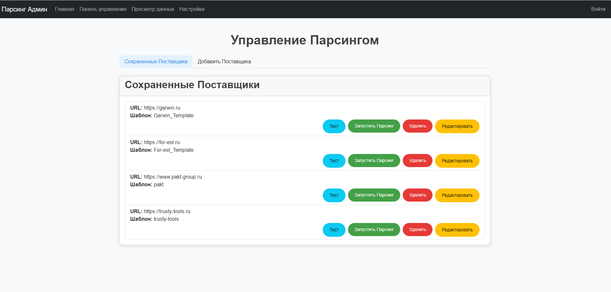
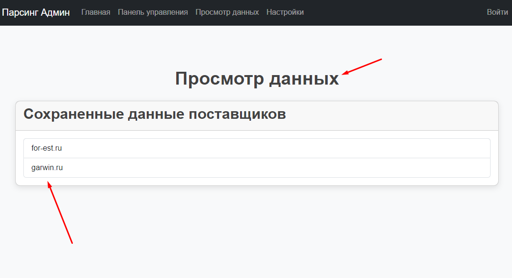
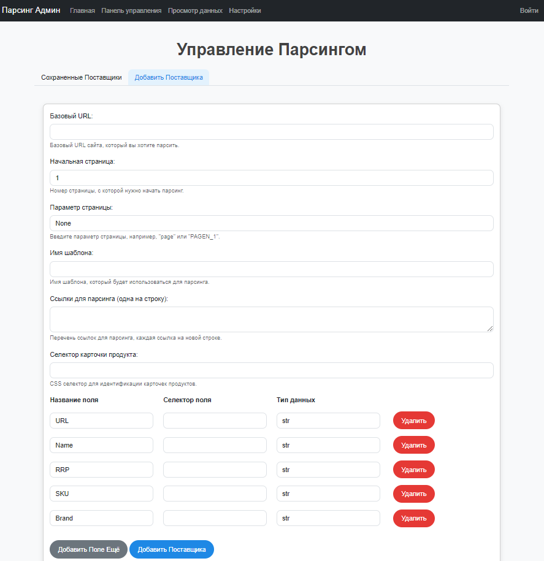
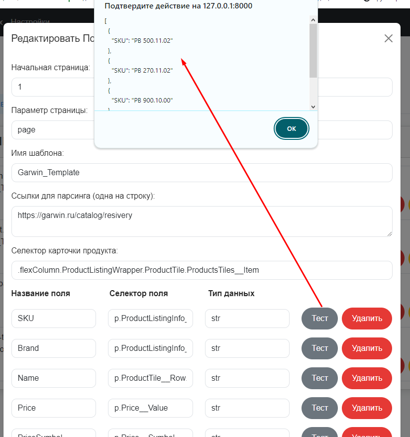
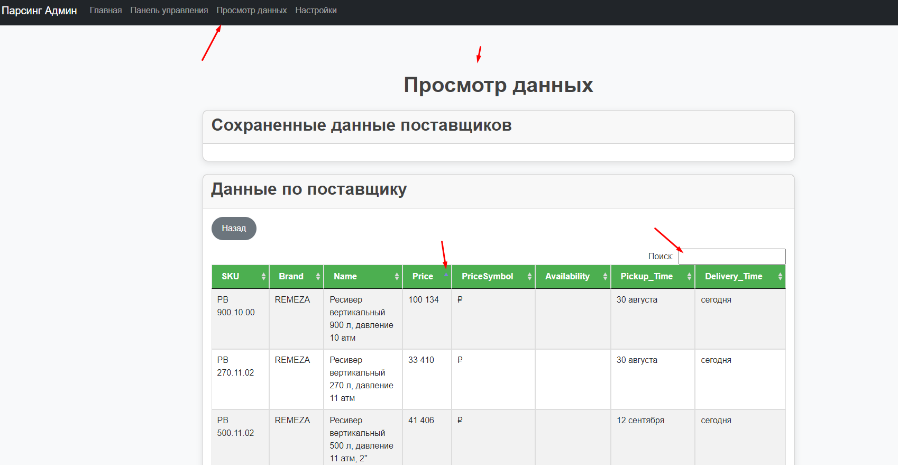
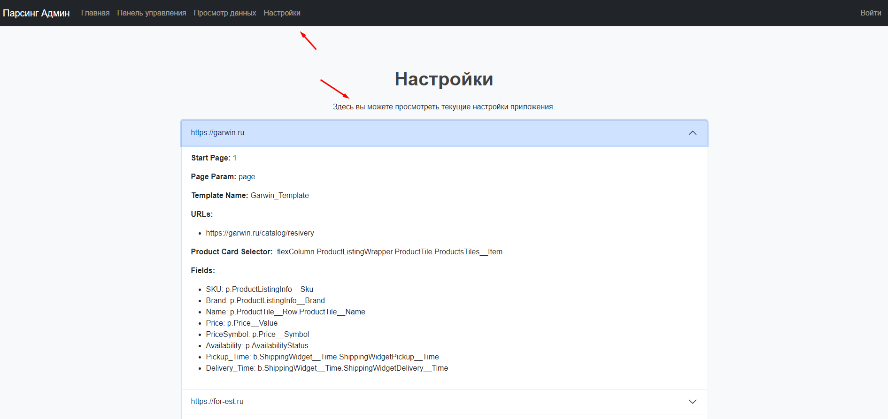

|               |                                           |
|---------------------------------------------|-----------------------------------------------------------------------------|
| Отображаются сохраненные сайты для парсинга | Можно редактировать HTML-код и сразу тестировать, парсятся ли нужные данные |

|    |                    |
|--------------------------------------|------------------------------------------------------|
| Добавление нового сайта для парсинга | Можно редактировать HTML-код, в случае его изменения |

|                                                                                               |                 |
|---------------------------------------------------------------------------------------------------------------------------------|---------------------------------------------------|
| Можно просматривать сохраненные в формат CSV данные напрямую из браузера, устанавливать сортировку и искать нужный[ые] товар[ы] | Отображаются текущие настройки сохраненных сайтов |
